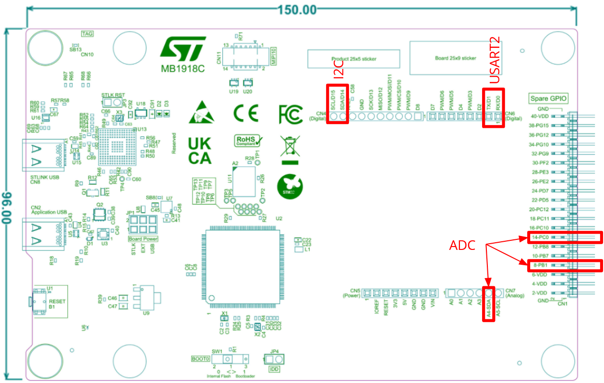
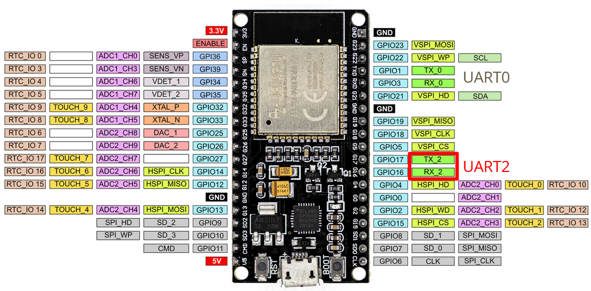
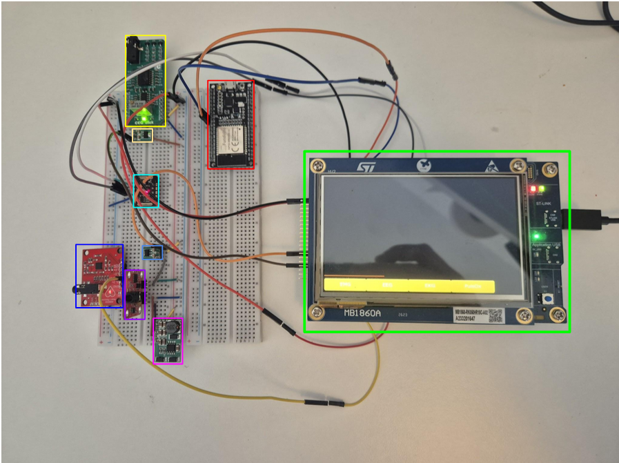

# Projektarbeit PES - IoMT

## Inhaltsverzeichnis

- [Handout](#handout)
    - [Repository](#repository)
    - [Shell Commands](#shell-commands)
    - [IDEs](#ides)
    - [Aufbau Hardware](#aufbau-hardware)
    - [Dashboard](#dashboard)
- [Notizen](#notizen)

## Handout

### Pinbelegung

<table>
<tr>
<th>
 Abb.1
 Abb.2
</th>
<th style="text-align:left;">

- STM-ADC1 → Sensor
- STM-ADC2 → Sensor
- STM-ADC4 → Sensor
- STM-I²C → Sensor Pulsoximeter
- STM-USART2 → ESP-UART2
</th>
</tr>
</table>

### Repository

```shell
git clone https://github.com/Bekky95/PES_IoMT.git 
```

https://github.com/nopnop2002/esp-idf-uart2mqtt 

→ originales Repository, eigene Anpassungen in main.c, mqtt_pub.c, uart.c

→ Files mit identischen Namen aus PES_IoMT Repo übernehmen

→ WIFI, UART Einstellungen anpassen (SSID, Passwort, UART TX und RX Ports

→ idf.py menuconfig, Anleitung in Repository, Expansion in VS Code ESP-IDF “Advanced” - “Classic Menuconfig” (siehe Issues)

→ Speichern, Kompilieren, Flashen auf ESP32

→ “Monitor Device” 


### IDEs

STMCubeIDE \
STMCubeMX \
VisualStudioCode \
Arduino 

### Aufbau Hardware

Anschluss EEG Click Modul (Abb. 3 Gelb): Das EEG Click modul benötigt 5V, und da der STM32U5 ADC nur bis 3,3V kann muss das Ausgangssignal vom EEG Click Modul ber den DC-DC-Wandler geführt werden. \
Anschluss EMG Sensor(Abb. 3  Lila): Der EMG Sensor benötigt eine symmetrische Spannungsversorgung zwischen ±3 bis ±30V. Deswegen muss der 5V Rail über den Vin des Symmetrischen Spannungswandler geführt werden, hier wird er in ±6V umgewandelt. Damit kann der EMG-Sensor mit Strom versorgt werden. Das Ausgangssignal muss aber wie beim EEG Modul über einen DC-DC-Wandler wieder auf 3,3V geregelt werden. \
Anschluss EKG Modul (Abb. 3  Blau): Das EKG Modul benötigt nur 3,3V und kann deswegen direkt zur STM32U5 angeschlossen werden. \
PulsOximeter: Kann auch mit 5V betrieben werden, aber da unser STM32U5 3,3V hat, besorgen wir ihn mit 3,3V. Hier kann der I2C Bus über die SCA/SCL Pins direkt an den STM32U5 angeschlossen werden. \
ESP32 Anschluss (Abb. 3  Rot): Da der ESP32 für diesen Prototyp direkt über den Micro-USB versorgt wird, müssen nur noch der GND und beide UART Pins mit dem in Tabelle 1 beschriebene Pins verbunden werden. 


 Abb.3


### Dashboard
https://light-osprey-3481.flowfuse.cloud/dashboard/page1 \
→ voraussichtlich ab Juli 2026 offline, da sonst Gebühren fällig werden \
→ export des Dashboards als json, liegt in [PES_IoMT Repository](./images/FlowFuse_flow_dashboard.json)


## Notizen

Beim initialen push hab ich einfach mal alles hochgeladen
-> ein gitignore fehlt noch 

Workflow:
-TouchGFX:
 -UI design tool that allows drag and drop design and generates the code for us
 -https://www.st.com/en/development-tools/touchgfxdesigner.html#section-get-software-table
 
-STM32CubeMX:
 -Configures hardware and generates init code
 -https://www.st.com/en/development-tools/stm32cubemx.html#
  
-STM32CubeIDE:
 -STMs IDE works well with other tools
 -https://www.st.com/en/development-tools/stm32cubeide.html
  
